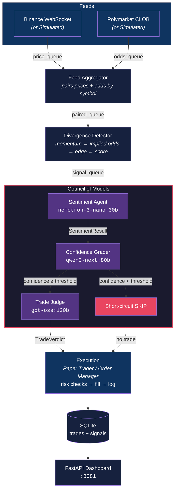

<div align="center">

# Polymarket AI Trading Agent

[](https://www.python.org/downloads/)
[](LICENSE)
[](#testing)
[](#)

**Autonomous crypto trading agent that detects price divergences between Binance and Polymarket prediction markets, then runs a council of 3 LLMs to decide trades.**

[Getting Started](#getting-started) | [Architecture](#architecture) | [Configuration](#configuration) | [Examples](#example-output)

</div>

---

> **Risk disclaimer:** trading prediction markets and cryptocurrencies carries significant risk of loss. This project is provided for research and educational purposes only. Default mode is **paper trading**. Use at your own risk.

## Table of Contents

- [Features](#features)
- [Tech Stack](#tech-stack)
- [Architecture](#architecture)
- [Getting Started](#getting-started)
  - [Prerequisites](#prerequisites)
  - [Installation](#installation)
  - [Configuration](#configuration)
  - [Usage](#usage)
- [How It Works](#how-it-works)
  - [Data Feeds](#1-data-feeds)
  - [Divergence Detection](#2-divergence-detection)
  - [Council of Models](#3-council-of-models)
  - [Execution](#4-execution)
  - [Risk Management](#5-risk-management)
- [Simulation Mode](#simulation-mode)
- [Example Output](#example-output)
- [Project Structure](#project-structure)
- [Architectural Decisions](#architectural-decisions)
- [Testing](#testing)
- [Database Schema](#database-schema)
- [Roadmap](#roadmap)
- [License](#license)
- [Author](#author)

## Features

- **Real-time divergence detection** between Binance spot prices and Polymarket prediction-market odds
- **Council of 3 LLMs** — sentiment, confidence, trade judge — with structured reasoning at every step
- **Thinking-mode support** — parses extended-thinking output from reasoning models (last-match strategy avoids echoed prompt content)
- **Short-circuit logic** to skip the expensive trade-judge call when confidence is below threshold
- **Risk management** with per-trade limits, portfolio caps, and per-symbol cooldowns
- **Paper trading** with full trade lifecycle logged to SQLite (signal → council reasoning → fill → P&L)
- **Simulation mode** with synthetic markets so the full pipeline runs end-to-end without live APIs
- **FastAPI dashboard** for real-time monitoring of trades and P&L
- **Async-first** architecture using `asyncio` throughout
- **55 tests** covering all pipeline components

## Tech Stack

| Component | Technology |
|-----------|------------|
| Language | Python 3.12+ |
| Runtime | `asyncio` event loop |
| LLM client | Ollama (cloud or local) |
| Sentiment model | `nemotron-3-nano:30b` |
| Confidence grader | `qwen3-next:80b` |
| Trade judge | `gpt-oss:120b` |
| Price feed | Binance WebSocket |
| Odds feed | Polymarket CLOB midpoint API |
| Storage | SQLite via `aiosqlite` |
| Config | Pydantic settings |
| Dashboard | FastAPI on `:8081` |
| Tests | `pytest`, `pytest-asyncio` |

## Architecture



## Getting Started

### Prerequisites

- Python 3.12+
- [Ollama](https://ollama.com) API key (cloud) or a local Ollama instance
- Binance WebSocket access (or stay in simulation mode — no external creds needed)

### Installation

```bash
git clone https://github.com/adityonugrohoid/polymarket-agent.git
cd polymarket-agent

python -m venv .venv
source .venv/bin/activate
pip install -r requirements.txt
```

### Configuration

```bash
cp .env.example .env
```

Edit `.env` with your settings:

<details>
<summary>Full configuration reference</summary>

```bash
# ── Trading ──────────────────────────────────────
TRADING_MODE=paper                    # paper or live
BINANCE_SYMBOLS=btcusdt,ethusdt,solusdt

# ── LLM (Ollama Cloud or local) ─────────────────
OLLAMA_HOST=https://ollama.com        # or http://localhost:11434
OLLAMA_API_KEY=your_key_here
LLM_MODEL_SENTIMENT=nemotron-3-nano:30b
LLM_MODEL_GRADER=qwen3-next:80b
LLM_MODEL_JUDGE=gpt-oss:120b

# ── Strategy Thresholds ─────────────────────────
MIN_EDGE_PCT=0.5                      # Minimum mispricing % to trigger signal
MIN_SIGNAL_SCORE=0.15                 # Minimum composite score (0-1)
MIN_CONFIDENCE=0.3                    # LLM confidence threshold for trade judge

# ── Risk Management ─────────────────────────────
MAX_CAPITAL=1000                      # Total portfolio cap ($)
MAX_POSITION_SIZE=50                  # Per-trade limit ($)
MAX_OPEN_POSITIONS=3                  # Max concurrent positions
COOLDOWN_SECONDS=30                   # Per-symbol cooldown after trade

# ── Simulation ──────────────────────────────────
SIMULATION_MODE=true                  # Use synthetic feeds
SIM_MARKETS_PER_SYMBOL=3
SIM_STRIKE_SPREAD_PCT=1.0
SIM_PRICE_LAG_SECONDS=5.0
SIM_NOISE_PCT=2.0
SIM_ODDS_INTERVAL=1.0

# ── Infrastructure ──────────────────────────────
DASHBOARD_PORT=8081
DB_PATH=data/trades.db
```

</details>

### Usage

```bash
# Start the agent
python agent.py

# Dashboard at http://localhost:8081
```

## How It Works

### 1. Data Feeds

- **Binance WebSocket** streams real-time prices for BTC, ETH, SOL with rolling 20-tick momentum
- **Polymarket CLOB** polls prediction-market odds every 5s via the midpoint API
- **Feed Aggregator** pairs each price tick with the latest odds for the same symbol

### 2. Divergence Detection

The strategy layer computes:

| Metric | Formula | Description |
|--------|---------|-------------|
| Implied fair odds | `market_odds + (momentum * 0.03)` | 1% price move = 3% odds adjustment |
| Edge | `implied_fair - market_odds` | The mispricing percentage |
| Composite score | `edge*0.5 + momentum*0.3 + volume*0.2` | Weighted signal strength (0-1) |

Signals fire when `edge > MIN_EDGE_PCT` and `score > MIN_SIGNAL_SCORE`.

### 3. Council of Models

Three LLMs evaluate each signal sequentially:

| # | Agent | Model | Role | Latency |
|---|-------|-------|------|---------|
| 1 | Sentiment | `nemotron-3-nano:30b` | Classify BULLISH / BEARISH / NEUTRAL | ~1.5s |
| 2 | Confidence | `qwen3-next:80b` | Grade signal quality 0.0–1.0 | ~12–20s |
| 3 | Trade Judge | `gpt-oss:120b` | Final TRADE/SKIP + position sizing | ~2s |

**Short-circuit:** if confidence < `MIN_CONFIDENCE`, the trade judge is skipped entirely.

**Thinking-mode support:** all parsers handle models that use extended thinking (`think=True`). When a response field exists, it's parsed directly. When the model puts everything in the thinking field, the parser searches the full text and takes the **last** match to avoid echoed prompt content.

### 4. Execution

| Mode | Status | Description |
|------|--------|-------------|
| Paper | **Active (default)** | Simulates fills at market midpoint; logs to SQLite with full council reasoning |
| Live | Scaffolded | `OrderManager` + `PolymarketClient` for authenticated CLOB orders on Polygon |

### 5. Risk Management

Enforced at the execution layer before every trade:

| Control | Default | Description |
|---------|---------|-------------|
| `MAX_OPEN_POSITIONS` | 3 | Max concurrent positions |
| `MAX_POSITION_SIZE` | $50 | Per-trade limit |
| `MAX_CAPITAL` | $1,000 | Total portfolio exposure cap |
| `COOLDOWN_SECONDS` | 30 | Per-symbol cooldown after trade |

## Simulation Mode

Polymarket currently has no short-term crypto price markets (only long-dated events like *"BTC hits $150k by June 2026"*), so the agent ships with a full simulation layer.

Set `SIMULATION_MODE=true` to activate:

| Component | Description |
|-----------|-------------|
| `SimulatedMarketGenerator` | Creates synthetic 15-min markets at 3 strike levels per symbol (-1%, 0%, +1%) |
| `SimulatedOddsFeed` | Computes odds from a deliberately lagged price buffer (5s lag creates divergence) |
| `SimulatedPriceFeed` | Gaussian random walk (mean +0.08%, stddev 1.2% per tick) |

**Odds formula:**
```python
distance = (lagged_price - strike) / strike
raw_odds = 0.5 + (distance * 10)          # 1% above strike → 0.6 odds
odds = clamp(raw_odds + noise, 0.05, 0.95)
```

The simulation is fully self-contained (no external APIs except Ollama) and removable by deleting `feeds/simulation.py` and the config branch in `agent.py`.

## Example Output

A complete council evaluation cycle from a live simulation run:

```
Signal: BTCUSDT | $89,086 | Momentum: +2.22% | Edge: +6.67% | Score: 0.47 | UP

  Sentiment  (nemotron, 1554ms)  → BULLISH
    "The upward momentum and positive edge indicate a bullish outlook."

  Confidence (qwen3, 15063ms)    → 0.47
    "Score below 0.5 indicates low confidence due to momentum
     sustainability concerns despite positive edge."

  Trade Judge (gpt-oss, 1801ms)  → SKIP, $0
```

When the judge decides to trade:

```
Signal: BTCUSDT | $87,822 | Momentum: +0.94% | Edge: +6.58% | Score: 0.46 | UP

  Sentiment  → BULLISH
  Confidence → 0.46
  Trade Judge → TRADE, $10
    "Positive edge (+6.58%) suggests a favorable expected value despite
     low confidence, so a modest $10 position limits risk while
     capturing upside."

  ✓ Paper trade executed: BUY btcusdt $10.00 @ 0.5096
```

## Project Structure

```
polymarket-agent/
├── agent.py                        # Main entry point — wires all components
│
├── feeds/                          # Data ingestion layer
│   ├── binance_ws.py               #   Binance WebSocket price streaming
│   ├── polymarket_odds.py          #   CLOB midpoint polling
│   ├── gamma_discovery.py          #   Market discovery via Gamma API
│   ├── feed_aggregator.py          #   Pairs price ticks with odds
│   └── simulation.py               #   Synthetic markets, odds, and prices
│
├── strategy/                       # Signal generation layer
│   ├── divergence_detector.py      #   Core divergence detection algorithm
│   ├── signal.py                   #   Composite signal scoring
│   └── thresholds.py               #   Default strategy constants
│
├── council/                        # LLM decision layer
│   ├── orchestrator.py             #   3-agent pipeline with short-circuit
│   ├── sentiment_agent.py          #   Agent 1: sentiment classification
│   ├── confidence_grader.py        #   Agent 2: confidence scoring 0-1
│   ├── trade_judge.py              #   Agent 3: final TRADE/SKIP decision
│   └── prompts.py                  #   Prompt templates
│
├── execution/                      # Trade execution layer
│   ├── paper_trader.py             #   Simulated trade execution
│   ├── order_manager.py            #   Live Polymarket CLOB orders
│   ├── polymarket_client.py        #   Authenticated CLOB client
│   └── position_tracker.py         #   Risk limits enforcement
│
├── storage/                        # Persistence layer
│   ├── db.py                       #   Async SQLite wrapper (aiosqlite)
│   └── models.py                   #   Table schemas
│
├── shared/                         # Shared utilities
│   ├── config.py                   #   Environment config (Pydantic)
│   ├── schemas.py                  #   Pipeline data models
│   ├── ollama_client.py            #   LLM client with thinking-mode
│   └── logging.py                  #   Structured JSON logging
│
├── dashboard/                      # Web monitoring
│   ├── main.py                     #   FastAPI dashboard
│   └── templates/index.html        #   Dashboard template
│
├── tests/                          # Test suite (55 tests)
├── .env.example                    # Configuration template
└── requirements.txt                # Python dependencies
```

## Architectural Decisions

### 1. Council of three, not one general-purpose call

**Decision:** Pipeline three smaller, specialized models (sentiment → confidence → judge) instead of one large general-purpose call.

**Reasoning:** Each model has a tight, easy-to-evaluate output schema (single label / single float / TRADE+size). Concatenating their reasoning into the trade record makes per-decision auditing trivial. Cost is the extra latency of three round-trips, mitigated by the short-circuit when confidence is low.

### 2. Short-circuit before the expensive judge

**Decision:** Skip the trade-judge call entirely when the confidence grader returns < `MIN_CONFIDENCE`.

**Reasoning:** The judge (`gpt-oss:120b`) is the slowest of the three. Most signals never clear the confidence bar — gating eliminates the dominant-cost call on the dominant case, dropping average per-signal LLM cost by an order of magnitude.

### 3. Last-match parsing for thinking-mode models

**Decision:** When parsing responses from reasoning models that emit extended `thinking` text, the parser scans the whole text and takes the **last** match.

**Reasoning:** Reasoning models often echo earlier prompt content or intermediate hypotheses inside their thinking trace. Taking the last match correlates strongly with the model's final decision, sidestepping a class of brittle regex-anchoring bugs we hit early on.

### 4. Simulation mode as a first-class build target

**Decision:** Ship a complete synthetic feed/market layer that runs the full pipeline without external APIs.

**Reasoning:** Polymarket has no short-term crypto markets today, so the live target is a future state. Simulation lets development, tests, and CI exercise the *whole* council + execution flow now, with one config flag rather than a separate harness.

## Testing

```bash
# Run all tests
python -m pytest tests/ -q

# Run with verbose output
python -m pytest tests/ -v

# Run specific module
python -m pytest tests/test_simulation.py -v
```

**Test coverage:**

| Module | Tests | Coverage |
|--------|-------|----------|
| Divergence detector | 5 | Signal generation, thresholds |
| Feed aggregator | 3 | Price+odds pairing |
| Sentiment agent | 4 | BULLISH/BEARISH/NEUTRAL parsing |
| Confidence grader | 4 | Float 0-1 parsing, clamping |
| Trade judge | 4 | TRADE/SKIP + size parsing |
| Orchestrator | 4 | Full pipeline, short-circuit |
| Paper trader | 5 | Execution, risk limits, P&L |
| Simulation | 11 | Market gen, odds lag, random walk |
| Signal scoring | 6 | Edge, momentum, volume, composite |
| Config | 3 | Env loading |

## Database Schema

```sql
-- Full trade lifecycle with council reasoning
CREATE TABLE trades (
    id INTEGER PRIMARY KEY AUTOINCREMENT,
    order_id TEXT UNIQUE, symbol TEXT, condition_id TEXT, token_id TEXT,
    side TEXT, size_usd REAL, entry_price REAL, exit_price REAL, pnl REAL,
    is_paper INTEGER, signal_score REAL, sentiment TEXT, confidence REAL,
    verdict TEXT, council_reasoning TEXT, opened_at TEXT, closed_at TEXT
);

-- All divergence signals for backtesting
CREATE TABLE signals (
    id INTEGER PRIMARY KEY AUTOINCREMENT,
    symbol TEXT, price REAL, momentum_pct REAL, odds_midpoint REAL,
    implied_fair_odds REAL, edge_pct REAL, signal_score REAL,
    direction TEXT, council_action TEXT, timestamp TEXT
);
```

## Roadmap

- [x] Real-time Binance price streaming
- [x] Polymarket odds polling via CLOB
- [x] Divergence detection with composite scoring
- [x] Council of 3 LLMs with short-circuit logic
- [x] Paper trading with full trade logging
- [x] Simulation mode for development
- [x] FastAPI dashboard
- [x] Thinking-mode LLM support
- [ ] Live trading via Polymarket CLOB
- [ ] WebSocket reconnection logic
- [ ] Position exit / take-profit / stop-loss
- [ ] Backtesting framework using signal history
- [ ] Multi-timeframe momentum analysis

## License

MIT — see [LICENSE](LICENSE).

## Author

**Adityo Nugroho** ([@adityonugrohoid](https://github.com/adityonugrohoid))
